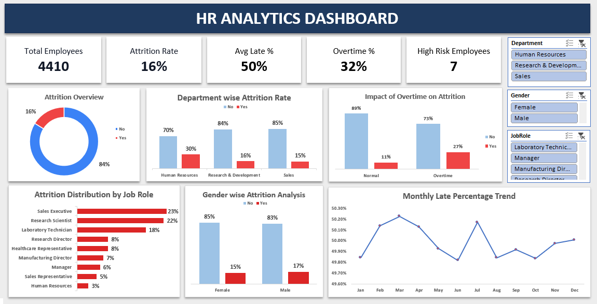
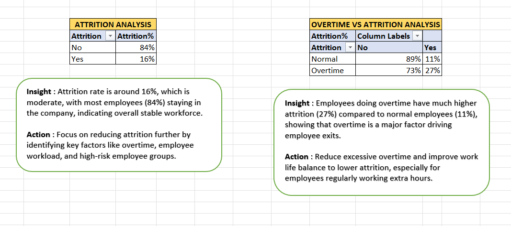
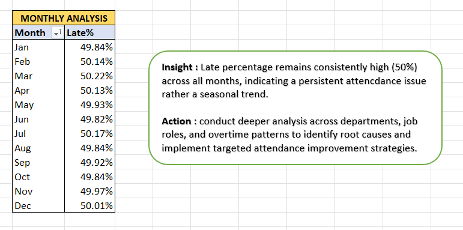
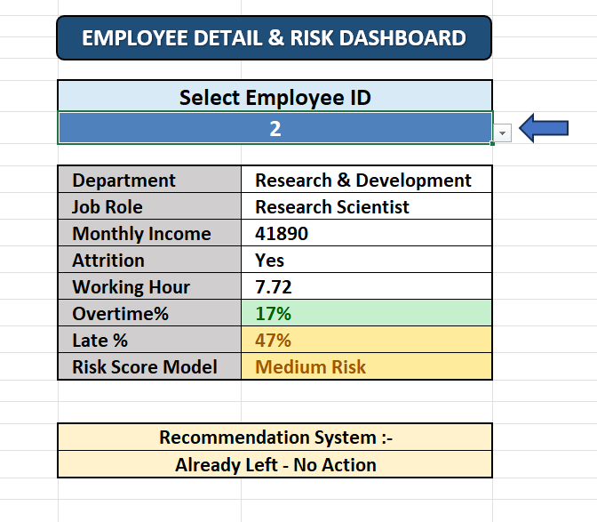

# HR Analytics Dashboard (Excel + VBA)

## 📌 Overview
This project is an end-to-end HR Analytics and MIS dashboard built using Excel, Power Query, and VBA.  
It helps track employee performance, monitor attrition, and automate reporting workflows.

## 📊 Key Features
- Integrated multiple HR datasets into a centralized master dataset  
- Transformed 250+ column attendance data into structured format using Power Query (Unpivot)  
- Built key metrics: Working Hours, Overtime %, Late %  
- Interactive dashboard with slicers and filters  

## ⚙️ Automation
- One-click data refresh  
- Reset filters  
- Export reports to PDF using VBA  

## 📈 Key Insights
- Attrition rate: ~16%  
- Higher attrition observed among employees with overtime (27% vs 11%)  
- Late percentage consistently high (~50%)  
- Role-wise and department-wise attrition patterns  

## 📂 Project File
Full Excel file: [Google Drive Link](https://drive.google.com/drive/folders/1DUAZFX8s0GNJinVl3vP_z5jLNQFGCEWd?usp=drive_link)

## 📷 Screenshots

